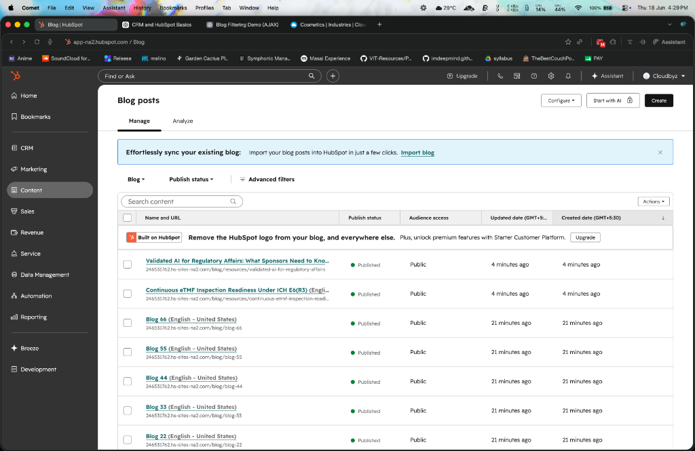
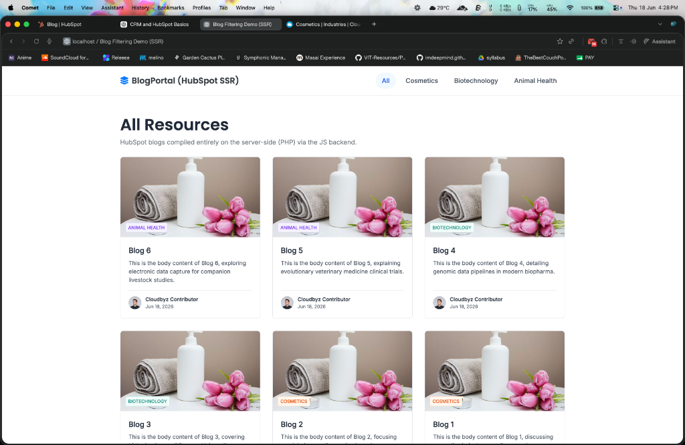
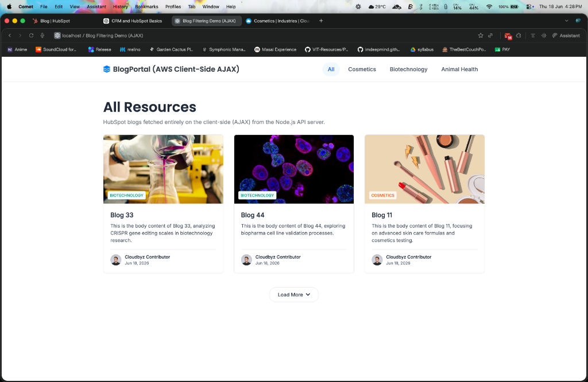
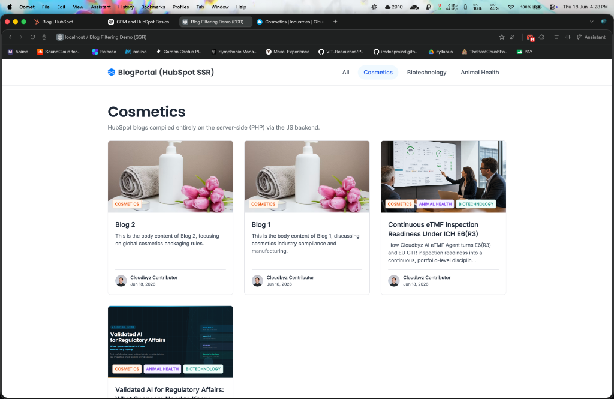
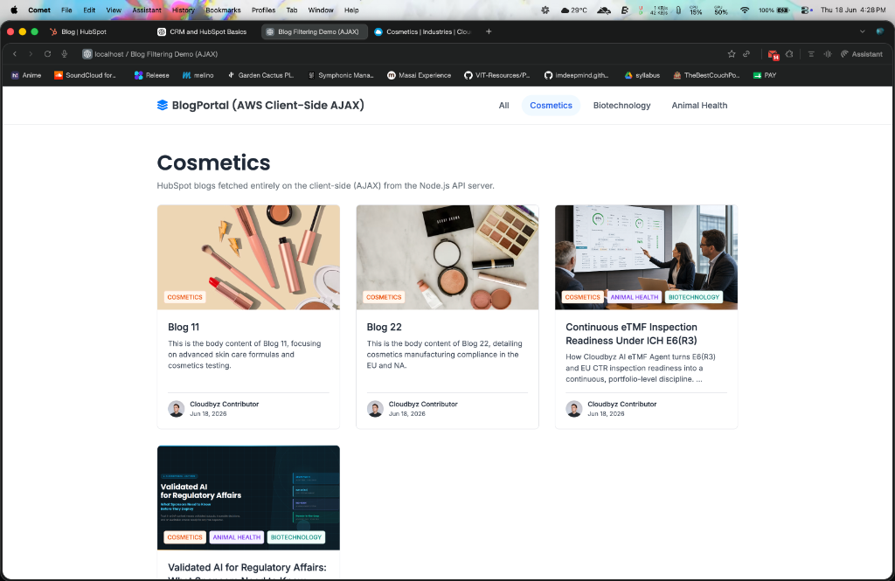
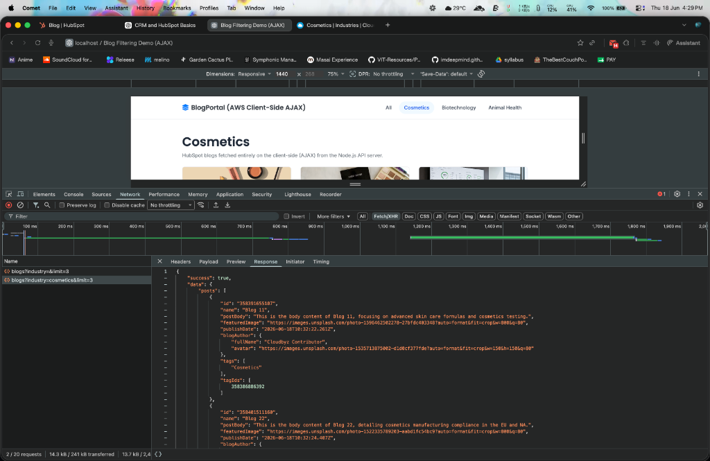
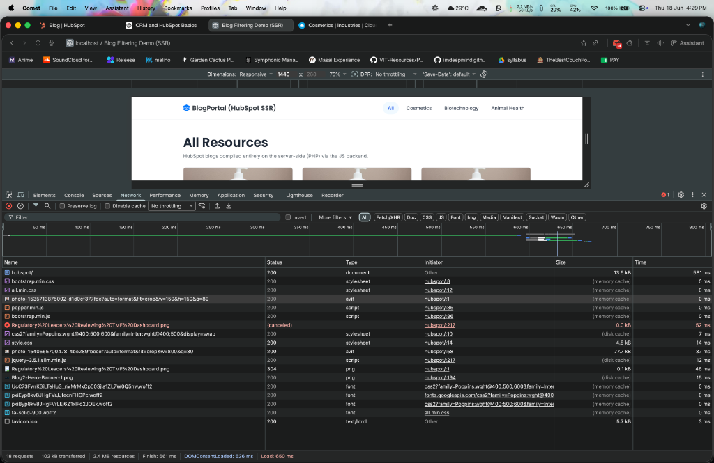

# Cloudbyz HubSpot vs AWS Blog Sandbox Portals

This sandbox replicates and compares the two distinct hosting and templating models used by Cloudbyz to deliver high-performance, visually rich blog portals. Both environments present the exact same design and layouts (inspired by the Cloudbyz Animal Health site) but operate on completely different rendering architectures, utilizing 10 advanced production-grade patterns.

---

## 📸 Sandbox Visual Walkthrough & System States

Here is a detailed visual guide of the running sandboxes showing how the live data maps across different architectures:

### 1. HubSpot Portal CMS Dashboard
Shows our active integration with the live HubSpot CRM database, managing both sandbox corporate posts and AWS Lambda mock posts under published states.


### 2. HubSpot SSR Portal — All Resources
Replicates the server-side pre-compiled template serving Corporate Blogs (Blog 1-6) on startup with zero client-side background network fetches.


### 3. AWS AJAX Portal — All Resources
Shows client-side loading of AWS mock blogs (Blog 11-66) using the cursor-based **Load More** pagination trigger.


### 4. HubSpot SSR — Cosmetics Industry Filter
Illustrates the active server-side route query `?industry=cosmetics` loading corporate Cosmetics blogs and the live *Continuous eTMF* corporate post.


### 5. AWS AJAX — Cosmetics Industry Filter
Demonstrates the client-side category filter active on **Cosmetics**, dynamically listing Cosmetics AWS blogs and the live *Continuous eTMF* post.


### 6. AWS AJAX — DevTools API Payload Inspection
Examines the Fetch/XHR response payload for `api/blogs?industry=cosmetics&limit=3`. Notice the `tagIds` array of numbers and the mapped tag string titles.


### 7. HubSpot SSR — DevTools Network Activity
Confirms the pure SSR model. The server resolves all content and transfers the complete HTML document; no client-side `api/blogs` Fetch/XHR network requests are executed.


---

## 📁 Directory Structure

```
blogs-fix/
├── .env                          # HubSpot Integration Credentials
├── .gitignore                    # Prevents credentials from tracking to git
├── README.md                     # Documentation (this file)
├── index.php                     # Root landing page (Sandbox Navigation)
├── assets/                       # Screenshots for documentation
│   ├── hubspot_admin_dashboard.png
│   ├── hubspot_all_resources.png
│   ├── aws_all_resources.png
│   ├── hubspot_cosmetics_filter.png
│   ├── aws_cosmetics_filter.png
│   ├── aws_network_devtools.png
│   └── hubspot_network_devtools.png
├── scripts/                      # Setup scripts for sandbox databases
│   └── publish-all-blogs.js      # Publishes all 14 blogs to the HubSpot CMS portal
├── hubspot/                      # HubSpot CMS Simulation (SSR Portal)
│   ├── index.php                 # Server-Side Rendered PHP (fetches from port 3000)
│   ├── style.css                 # Custom CSS stylesheet copy
│   └── hubspot.js                # API server on port 3000 (Filters out AWS blogs)
└── aws/                          # AWS Simulation (AJAX Client-Side Portal)
    ├── index.php                 # Client-Side AJAX Fetch (fetches from port 3001)
    ├── style.css                 # Custom CSS stylesheet copy
    └── aws.js                    # AWS Lambda simulation API on port 3001
```

---

## ⚙️ The 10 Production-Grade Patterns Implemented

Our sandbox implements 10 specific production behaviors mapped from the Cloudbyz production environments:

### 1 & 2. Tag ID Mapping & Industry Slug Parameter
We map user-friendly industry slugs passed via URL query parameters (`?industry=cosmetics`) or data attributes directly to static tag IDs on the backend:
- `cosmetics` $\rightarrow$ `358386886392`
- `biotechnology` $\rightarrow$ `358399551183`
- `animal-health` $\rightarrow$ `358386887359`

### 3 & 4. Content Group ID & Live Query Params
Every backend request strictly filters blogs at the HubSpot database layer, appending both `contentGroupId` and `tagId__eq` values to the API requests rather than filtering after fetching:
```
GET https://api.hubapi.com/cms/v3/blogs/posts?state=PUBLISHED&sort=-publishDate&limit=100&contentGroupId=358277137128&tagId__eq=358386886392
```

### 5. Cursor Pagination (`after` token)
The API supports cursor-based pagination using `limit` and `after` cursor values. The backend returns a matching sliced array, a `hasMore` status flag, and the next `after` index token. The AWS frontend uses this token to fetch next pages on clicking the **Load More** button.

### 6 & 7. Tag & Author Resolving Cache
- Avoids making separate dynamic API requests during individual blog queries by querying `/cms/v3/blogs/authors` once at server startup and caching the names and avatars in memory.
- Uses `REVERSE_TAG_MAP` to translate tag IDs back to user-friendly titles instantly.

### 8. Image Fallbacks
Resolves `post.featuredImage` directly, falling back to a curated placeholder image if the field is completely null or empty.

### 9. Multi-Content Type Badges
Supports custom styles for additional tags like case studies, whitepapers, and videos:
- `.tag-whitepaper` (Blue badge theme)
- `.tag-case-study` (Pink badge theme)
- `.tag-video` (Red badge theme)

### 10. Architectural Separation (SSR vs AJAX)
- **HubSpot SSR Portal (`/hubspot`)**: Complies with standard CMS practices. The PHP backend compiles HTML server-side by fetching from port 3000. Navigating tabs triggers page reloads. DevTools registers **zero client-side XHR calls to fetch blogs**.
- **AWS AJAX Portal (`/aws`)**: Complies with the GoDaddy-integrated AWS Lambda model. The page serves a skeleton, renders a loading spinner, and runs client-side AJAX requests to port 3001. Navigating categories updates content instantly without a page reload.

---

## 🛠️ Verification & Run Instructions

### 1. Configure Credentials & Seed Blogs
Create a `.env` file in the root directory:
```env
HUBSPOT_TOKEN=your_private_app_access_token_here
HUBSPOT_BLOG_ID=01234567890
```

If you need to seed or populate your HubSpot sandbox portal with all 14 blogs (Blog 1-6, Blog 11-66, and the 2 corporate posts), run the seeder script:
```bash
node scripts/publish-all-blogs.js
```

### 2. Start Backend APIs
Start the Node.js API servers in the background:
```bash
# Start HubSpot SSR simulation API (Port 3000)
node hubspot/hubspot.js

# Start AWS Lambda simulation API (Port 3001)
node aws/aws.js
```

### 3. Start PHP Server
Start the local PHP server in the root workspace folder:
```bash
php -S localhost:8000
```

### 4. Verify in Browser
Open **[http://localhost:8000/](http://localhost:8000/)** and test the portals. Open Chrome DevTools (`Network` tab $\rightarrow$ `Fetch/XHR`) to trace the network requests:
- `/hubspot/` will show zero background network fetches for blogs.
- `/aws/` will show requests logged to `http://localhost:3001/api/blogs?industry=...&limit=3` as you click tabs and hit **Load More**.
